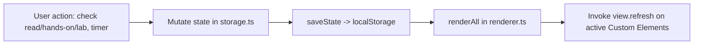

# ARCHITECTURE & REPLICATION GUIDE

This document summarizes the complete technical architecture, technology stack, design patterns, project directory structure, data flow, and state management intended for the **Vanilla Web Book Tracker** app. It is designed as a **Master Blueprint** so any AI Agent or developer can build this app from scratch, purely from the docs in this repo — no source code exists yet.

> [!NOTE]
> This blueprint is adapted from the architecture of a sibling project, the *Applied AI Engineer Roadmap 2026* tracker (a working SPA with the same architecture, different content domain). The patterns below are proven in that codebase; only the content model and progress formula differ here.

---

## 1. Architectural Overview

The application is a **Single Page Application (SPA)** for tracking reading and hands-on progress through the book *Vanilla Web* (Manning), chapter by chapter, section by section.

- **Core Philosophy**: Lightweight, zero-framework runtime overhead, modularized using **Vanilla TypeScript** combined with **Custom Elements (Web Components — Light DOM)** and **Layered Vanilla CSS**. The app deliberately does not use any of the frameworks the book itself teaches you to do without.
- **Data-Driven Architecture**: 100% of book content (chapters, sections, sub-sections, labs, flashcard tasks, glossary, resources, quit criteria) is decoupled into `src/data/bookData.vi.ts` / `bookData.en.ts`, one file per language, identical `id`s — see **[book_data_model_guide.md](./book_data_model_guide.md)** for the full schema and id map. `src/data/bookData.ts` is a thin facade selecting the active bundle by `state.lang`.
- **Centralized State Store & Client-side Persistence**: Singleton `AppState` in `src/state/storage.ts`. Read/hands-on/lab/flashcard progress, theme, language, resource bookmarks, and Pomodoro session logs persist to `localStorage`, with JSON Import/Export for backup.
- **i18n**: Vietnamese/English UI chrome driven by `src/i18n/` (`t()`/`plural()` string lookup + a `data-i18n` DOM sweep for static header markup); book content is the two `bookData.*.ts` files above.
- **Observer-Driven Reactive Loop**: automatic sync between the State Store and active Custom Elements without a Virtual DOM.
- **Independent Pomodoro Engine**: countdown timer with Web Audio API chime and browser notifications — tracked and displayed, but **excluded from the progress formula** (see Pattern 4).

---

## 2. Tech Stack Details

| Component | Technology Used | Role & Selection Rationale |
| :--- | :--- | :--- |
| **Bundler & Dev Server** | **Vite 6.4+** | Fast HMR, native TypeScript support, minimal config. |
| **Language** | **TypeScript 5.8+** | Strict Type Safety (`tsc --noEmit`), autocompletion for the data model in `book_data_model_guide.md`. |
| **UI Framework** | **Vanilla Web Components (Light DOM)** | Extends `HTMLElement` without Shadow DOM to share global CSS Tokens and utility classes. |
| **Styling** | **Vanilla CSS (`@layer` + CSS Variables)** | `@layer` to avoid specificity wars; CSS Custom Properties for Dark/Light theme. |
| **State Management** | **Centralized Store + Observer Re-render** | `src/state/storage.ts` syncs with `localStorage` and triggers `renderAll()`. |
| **Router** | **Hash Router (`#/route`)** | `window.onhashchange`, syncs URL hash, active tab, `localStorage`. |
| **Icons & Audio** | **SVG Dictionary + Web Audio API** | `src/utils/icons.ts`, `src/utils/audio.ts` — no external mp3/icon-font assets. |
| **Deployment** | **GitHub Actions + GitHub Pages** | Builds `dist/` and deploys with `base: './'` in `vite.config.ts`. See **[github_pages_deployment_guide.md](./github_pages_deployment_guide.md)**. |

---

## 3. Project Directory Structure

Full directory tree and file responsibilities: **[project_structure.md](./project_structure.md)**.

### High-level modules
- **`docs/`**: this documentation set (`docs/guides/`, `docs/content/`).
- **`public/`**: static assets (`favicon.svg`).
- **`src/data/`**: `bookData.vi.ts` / `bookData.en.ts` + `bookData.ts` facade — 100% of book content, one file per language.
- **`src/state/`**: `storage.ts` — singleton `AppState`, `localStorage`.
- **`src/i18n/`**: `strings.ts`, `index.ts` (`t()`/`plural()`), `dom.ts` (static header sweep).
- **`src/views/`**: `<book-view-*>` Custom Elements for the 6 tabs (Dashboard, Chapters, Labs, Glossary, Resources, Quit Criteria).
- **`src/styles/`**: layered CSS (`@layer`) + CSS Custom Properties (`_tokens.css`).
- **`src/actions/`**, **`src/utils/`**, **`src/types/`**: pure utilities, type interfaces, backup/restore.

---

## 4. Core Design Patterns & Architecture Principles

### Pattern 1: Data-Driven UI Architecture
- **Principle**: 100% of book content lives in `src/data/bookData.vi.ts` / `bookData.en.ts`, read through the `src/data/bookData.ts` facade (`getChapters()`, `getMetaData()`, `getLabs()`, `getGlossary()`, `getResources()`, `getQuitCriteriaData()`) rather than imported directly, so a language switch repaints with the correct bundle.
- **Primary Key Constraint**: every Chapter, Section, Lab, FlashcardTask, GlossaryTerm, Resource, and QuitCriteriaRow **MUST** have a unique static `id` (see **[book_data_model_guide.md](./book_data_model_guide.md)** section 4), identical across both language files.
- **Critical Warning for AI Agents**: never rename or reassign an existing item `id` — it is the primary key for completion state in `localStorage`. When adding or editing content, edit both `bookData.vi.ts` and `bookData.en.ts` together; a dev-only check in `bookData.ts` must log a console error if their id sets ever diverge.

### Pattern 2: Light-DOM Custom Elements Pattern & Lifecycle Management
```typescript
export class BookViewDashboard extends HTMLElement {
  private boundRefresh = this.refresh.bind(this);

  connectedCallback(): void {
    registerRenderListener(this.boundRefresh);
    this.refresh();
  }

  disconnectedCallback(): void {
    unregisterRenderListener(this.boundRefresh);
  }

  refresh(): void {
    // 1. Fetch latest data from state storage & progress engine
    const stats = calculateProgress();
    // 2. Generate HTML string & update innerHTML
    // 3. Attach event listeners to newly rendered interactive elements
  }
}
customElements.define("book-view-dashboard", BookViewDashboard);
```

### Pattern 3: Unidirectional Data Flow & Observer Re-render Loop


### Pattern 4: Three-Axis Progress Engine (`src/progress.ts`)
Unlike a single deliverables/pomodoro split, this tracker weighs three independent axes:

\[
\text{Overall \%} = (\text{Read \%} \times 0.4) + (\text{Hands-on \%} \times 0.4) + (\text{Chapter deliverables \%} \times 0.2)
\]

- **Read %** = sections with `read[id] === true` / 95 total sections.
- **Hands-on %** = sections with `handsOn[id] === true` / 95 total sections.
- **Chapter deliverables %** = (`labDone` count + `flashcardDone` count) / (15 labs + 15 flashcard tasks = 30).
- **Pomodoro sessions are tracked and displayed (total sessions, total hours) but deliberately excluded from this formula** — reading a book isn't well modeled by time-boxed focus sessions the way writing code deliverables is; forcing it into the weight would reward clock-watching over comprehension.
- Active chapter = first chapter that is not 100% read+hands-on.
- Next section recommendation = first section in the active chapter with `read === false`.

### Pattern 5: Modular Layered CSS System with CSS Custom Properties
```css
@layer reset, base, components, views, utilities;

@import "./_tokens.css" layer(base);
@import "./_reset-base.css" layer(reset);
@import "./_header.css" layer(components);
@import "./_tabs.css" layer(components);
@import "./_main-layout.css" layer(components);
@import "./_views.css" layer(views);
@import "./_responsive.css" layer(utilities);
```
Dark/Light theme via `data-theme` on `<html>`, same token-swap approach as the sibling project. See **[ui_system_design_guide.md](./ui_system_design_guide.md)**.

---

## 5. Step-by-Step Blueprint for AI Agents

> [!IMPORTANT]
> Before writing any code, read all 6 guides in `docs/guides/` in this order: **book_data_model_guide.md** (the schema and 95-section id map) → **architecture_guide.md** (this file) → **project_structure.md** → **interactive_components_guide.md** (PRD/UX) → **ui_system_design_guide.md** (tokens/CSS) → **github_pages_deployment_guide.md** (CI/CD).

### Step 1: Initialize Repository & Build Environment
1. `package.json` scripts: `"dev": "vite"`, `"build": "tsc --noEmit && vite build"`, `"preview": "vite preview"`, `"typecheck": "tsc --noEmit"`.
2. `devDependencies`: `typescript`, `vite`.
3. `vite.config.ts` with `base: './'`.

### Step 2: Core Types & State Store
1. `src/types/appState.ts`: interfaces from **book_data_model_guide.md** section 2–3 (`Chapter`, `Section`, `Lab`, `FlashcardTask`, `GlossaryTerm`, `Resource`, `QuitCriteriaRow`, `AppState`).
2. `src/constants.ts`: `STORAGE_KEY`, `THEME_KEY`, `LANG_KEY`, `ROUTE_IDS`.
3. `src/state/storage.ts`: singleton `AppState`, `loadState()`, `saveState()`, `setThemeState()`, `setLangState()`, `toggleRead(sectionId)`, `toggleHandsOn(sectionId)`, `toggleLabDone(labId)`, `toggleFlashcardDone(flashcardId)`, `addPomodoroSession()`.

### Step 3: Data Model (`src/data/bookData.<lang>.ts`)
1. Populate all 15 `Chapter` objects, 95 `Section` objects, 15 `Lab` objects, 15 `FlashcardTask` objects, glossary and resources — content sourced from `docs/content/chapters.md`, `labs.md`, `glossary.md`, `resources.md`, `quit_criteria_guide.md`.
2. Ids identical across both language files, exactly as listed in **book_data_model_guide.md**.
3. `src/i18n/` for UI chrome text.

### Step 4: Progress Engine (`src/progress.ts`)
Implement `calculateProgress()` per Pattern 4 above.

### Step 5: Router & Central Renderer
1. `src/renderer.ts`: `registerRenderListener()`, `renderAll()`.
2. `src/router.ts`: hash routing across `#/dashboard`, `#/chapters`, `#/labs`, `#/glossary`, `#/resources`, `#/quitcriteria`.

### Step 6: Custom Element Views (`src/views/`)
One `<book-view-*>` per tab per **[interactive_components_guide.md](./interactive_components_guide.md)**.

### Step 7: HTML Shell, Design System & Bootstrap
`index.html` (header, nav tabs, view containers), CSS tokens/layers per **[ui_system_design_guide.md](./ui_system_design_guide.md)**, `src/main.ts` bootstrap.

### Step 8: CI/CD
`.github/workflows/deploy.yml` per **[github_pages_deployment_guide.md](./github_pages_deployment_guide.md)**.

---

## 6. Verification Checklist

- [ ] `npm run typecheck` passes with zero errors.
- [ ] `bookData.*.ts` contains exactly 15 chapters and 95 sections (see counts table in `book_data_model_guide.md` §6).
- [ ] `npm run build` produces `dist/` with relative asset paths.
- [ ] `.github/workflows/deploy.yml` builds and deploys to GitHub Pages.
- [ ] Toggling a read/hands-on checkbox instantly updates the progress badges.
- [ ] Reloading the page (F5) preserves all progress, theme, language, and active tab.
- [ ] Pomodoro timer runs, chimes, logs sessions — and does **not** move the overall progress %.
- [ ] Export JSON / Import JSON round-trip restores identical state.
